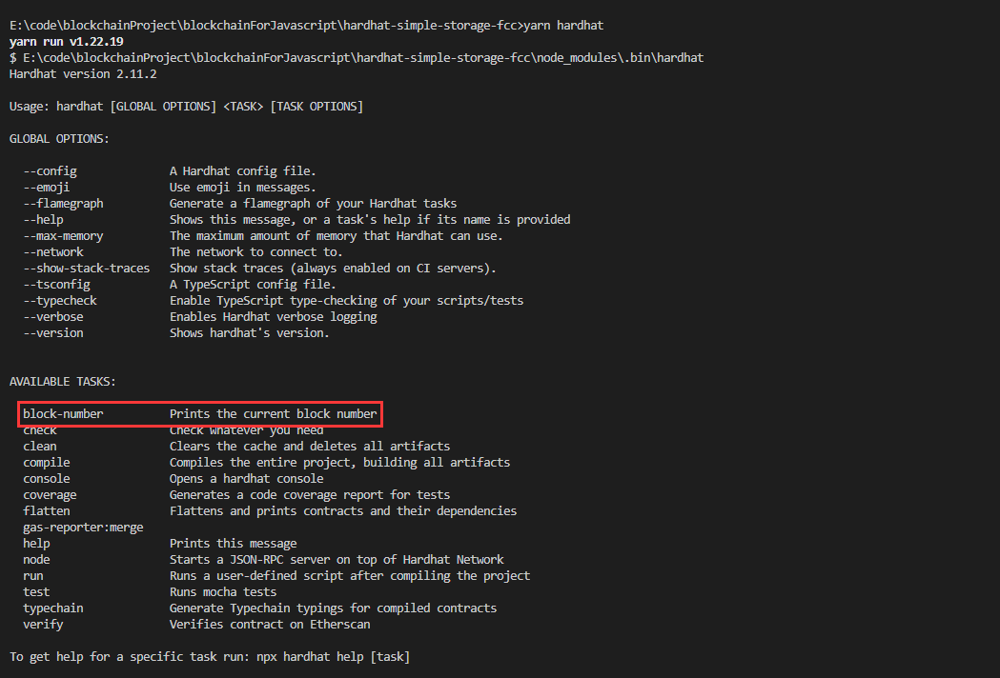

## 仓库介绍
> 这是我第一个使用hardhat框架实现的合约
> repo主要是通过yarn包管理工具完成所有的准备和部署工作
## 框架安装
1. 初始化项目：yarn init 
    > 主要就是新建一个package.json的文件
2. 安装hardhat：yarn add --dev hardhat
    > 安装一系列项目所需要的依赖包，并将其全部存在node_modules文件夹中
3. 创建基于hardhat的项目：yarn hardhat
    > 一直回车就好，需要注意我们创建项目是基于什么语言。JavaScript还是Typescript
4. 安装一系列的包：yarn add --dev @nomicfoundation/hardhat-toolbox @nomicfoundation/hardhat-network-helpers @nomicfoundation/hardhat-chai-matchers @nomiclabs/hardhat-ethers @nomiclabs/hardhat-etherscan chai ethers hardhat-gas-reporter solidity-coverage @typechain/hardhat typechain @typechain/ethers-v5 @ethersproject/abi @ethersproject/providers
    > 这一步一定要做，不然项目跑不起来的
5. 查看hardhat提供什么命令：yarn hardhat help
    ```shell
    yarn hardhat help
        clean                 清除缓存
        compile               编译合约
        console               打开hardhat的控制台，支持命令行执行合约
        help                  输出帮助信息
        node                  在本地开启一个网络节点，和ganache的作用一样
        run                   执行合约部署信息
        test                  测试合约部署信息
        verify                部署合约并且进行校验合约内容
    ```

## 项目部署

1. 编译合约

   ```shell
   yarn hardhat compile
   ```

2. 部署合约

   > - 导包
   > - 编写main函数
   > - 执行main函数

   ```js
   // 1. 导包
   const { ethers, run, network } = require("hardhat")
   
   // 2. 编写main函数
   async function main() {
       // 获取合约的工厂对象
       const SimpleStorageFactory = await ethers.getContractFactory("SimpleStorage")
       console.log("Deploying contract...")
       // 部署合约
       const simpleStorage = await SimpleStorageFactory.deploy()
       // 等待合约部署完成
       await simpleStorage.deployed()
       console.log(`Deployed contract to: ${simpleStorage.address}`)
   }
   
   
   // 3. 执行main函数
   main()
       .then(() => {
           process.exit(0)
       })
       .catch((error) => {
           console.log(error)
           process.exit(1)
       })
   ```

3. 调用合约函数

   ```js
   // 1. 导包
   const { ethers, run, network } = require("hardhat")
   
   // 2. 编写main函数
   async function main() {
       // 获取合约的工厂对象
       const SimpleStorageFactory = await ethers.getContractFactory("SimpleStorage")
       console.log("Deploying contract...")
       // 部署合约
       const simpleStorage = await SimpleStorageFactory.deploy()
       // 等待合约部署完成
       await simpleStorage.deployed()
       console.log(`Deployed contract to: ${simpleStorage.address}`)
   
       // 获取合约中favoriteNumber状态
       const currrentValue = await simpleStorage.retrieve()
       console.log(`Current Value is: ${currrentValue}`)
   
       // 修改合约中favoriteNumber的状态
       const transactionResponse = await simpleStorage.store(8)
       await transactionResponse.wait(1)
   
       // 获取修改后的favoriteNumber的状态
       const updatedValue = await simpleStorage.retrieve()
       console.log(`Updated value is :${updatedValue}`)
   }
   
   // 3. 执行main函数
   main()
       .then(() => {
           process.exit(0)
       })
       .catch((error) => {
           console.log(error)
           process.exit(1)
       })
   ```

4. 执行脚本

   > 指定部署在那个网络上，用哪个钱包地址部署，都是在配置文件中配置的。

   ```shell 
   yarn hardhat run 脚本文件名 --network 指定部署在那个网络上
   
   yarn hardhat run scripts/deploy.js # 部署在hardhat默认的网络上，也是使用fake account
   yarn hardhat run scripts/deploy.js --network rinkeby # 部署在以太坊的rinkeby的测试网上
   ```

## 配置文件

> 在hardhat中，所有的配置信息都在`hardhat.config.js`文件中。

```js
require("@nomicfoundation/hardhat-toolbox") // hardhat工具包
require("dotenv").config() // 加载隐私信息，比如私钥等，加载的文件名是.env
require("@nomiclabs/hardhat-etherscan") // 在主网上核验合约
require("./tasks/block-number") // 加载自定义的函数
require("hardhat-gas-reporter") // 加载统计gas花费
require("solidity-coverage") // 统计测试用例覆盖率

// 下面四个都是从.env文件中加载隐私信息数据
const RINKEBY_RPC_URL = process.env.RINKEBY_RPC_URL // rinkeby测试网的rpc地址
const PRIVATE_KEY = process.env.PRIVATE_KEY // 钱包的私钥
const ETHERSCAN_API_KEY = process.env.ETHERSCAN_API_KEY // 核验合约的api_key，这是etherscan上的
const COINMARKETCAP_API_KEY = process.env.COINMARKETCAP_API_KEY 

module.exports = {
	// 默认部署的网络    
    defaultNetwork: "hardhat", 
    
    // 可选择的可部署的网络节点信息
    networks: {
        // 配置一个线上的测试网
        rinkeby: {
            url: RINKEBY_RPC_URL, // rinkeby网络的rpc地址
            accounts: [PRIVATE_KEY], // rinkeby网络上的一个钱包私钥
            chainID: 4, // rinkeby的chainID，每个网络都有自己的唯一的chainId
        },
        // 配置了一个本地的测试网，这是ganache
        ganache: {
            url: "http://127.0.0.1:7545",
            accounts: [
                "3939e97fd6f8e8f8c18e4c460f1cdcf9ccb125974eaec299d08c327e72c55d2e",
            ],
            chainID: 1337,
        },
        // 配置hardhat自带的网络
        localhost: {
            url: "http://127.0.0.1:8545/",
            // accounts: []
            chainID: 31337,
        },
    },
    
    // 编译合约使用那个版本编译器
    solidity: "0.8.17",
    
    // 核验合约的秘钥
    etherscan: {
        apiKey: ETHERSCAN_API_KEY,
    },
    
    // 统计合约一系列操作所消耗的gas费
    gasReporter: {
        enabled: false, // 开启gas花费统计
        // outputFile: "gas-reporter.txt", // 将gas统计结果输出到文件
        noColor: true, // 关闭颜色显示
        currency: "USD", // 以$为统计花费单位
        // coinmarketcap: COINMARKETCAP_API_KEY,
        token: "MATIC",
    },
}
```

```
RINKEBY_RPC_URL=https://rinkeby.infura.io/v3/xxxxx 
PRIVATE_KEY=xxxxx
ETHERSCAN_API_KEY=xxxx
COINMARKETCAP_API_KEY=xxxxxxxxxxxxxxxx
```

## 项目测试

> 项目的测试用例全部都写在`test`文件夹中

```js
const { ethers } = require("hardhat") // 导入ethers包
const { assert, expect } = require("chai") // 导入测试包

describe("SimpleStorage", function () {
    let simpleStorageFactory, simpleStorage
    // beforeEach可以理解为初始化工作
    beforeEach(async function () {
        simpleStorageFactory = await ethers.getContractFactory("SimpleStorage")
        simpleStorage = await simpleStorageFactory.deploy()
    })
    // 写测试用例
    it("Should start with a favorite number of 0", async function () {
        const currentValue = await simpleStorage.retrieve()
        const expectValue = "0"
        assert.equal(currentValue.toString(), expectValue) // 断言第一个参数和第二个参数的值是相等的
        // expect(currentValue.toString()).to.equal(expectValue)
    })
    // it.only("Should update when we call store", async function(){ // 只执行该测试用例
    it("Should update when we call store", async function () {
        const expectValue = "19"
        const transactionResponse = await simpleStorage.store(19)
        await transactionResponse.wait(1)

        const currentValue = await simpleStorage.retrieve()

        assert.equal(currentValue.toString(), expectValue)
    })
})
```

执行测试

```shell 
yarn hardhat test # 该命令会执行全部的测试用例
yarn hardhat test grep xxx # 会从全部的测试用例中筛选出符合xxx的测试用例，那是根据什么筛选呢？
it("Should start with a favorite number of 0", async function () {}) 就是根据it函数第一个参数筛选
```

## task的使用

> task的作用，本人认为就是自己写命令，比如，在hardhat中，框架为我们集成了hardhat run、hardhat test等命令，而task就是这个作用，当框架提供的命令不够我们使用时，我们可以根据自己的需求自定义。

实现步骤：

1. 在根目录新建一个`tasks`文件夹并在其内部新建一个js文件

```js
const { task } = require("hardhat/config")

task("block-number", "Prints the current block number").setAction(
    async (taskArgs, hre) => {
        const blockNumber = await hre.ethers.provider.getBlockNumber()
        console.log(`Current block number: ${blockNumber}`)
    }
)

module.exports = {}
```

2. 在`hardhat.config.js`中导入该task文件

```js
...

require("./tasks/block-number")

...

module.exports = {
	...
}
```

效果



## verify合约

> 我在执行核验合约的时候，一直报错，提示说连接超时，目前还是没有解决。

步骤

1. 首先在配置文件中编写如下内容

```js
...
require("dotenv").config()
require("@nomiclabs/hardhat-etherscan")
...

const ETHERSCAN_API_KEY = process.env.ETHERSCAN_API_KEY
...

module.exports = {
	...
    etherscan: {
        apiKey: ETHERSCAN_API_KEY,
    },
	...
}
```

2. 在编写校验函数

```js
async function verify(contractAddress, args) {
    // contractAddress：是合约的部署地址
    // args：合约构造函数的参数，没有就为空数组
    // 如果合约已经完成核验，就会抛出一个错误
    console.log("Verifying contract...")
    try {
        await run("verify:verify", {
            address: contractAddress,
            constructorArgsParams: args,
        })
    } catch (e) {
        if (e.message.toLowerCase().includes("already verify")) {
            console.log("Already Verify!")
        } else {
            console.log(e)
        }
    }
}
```

